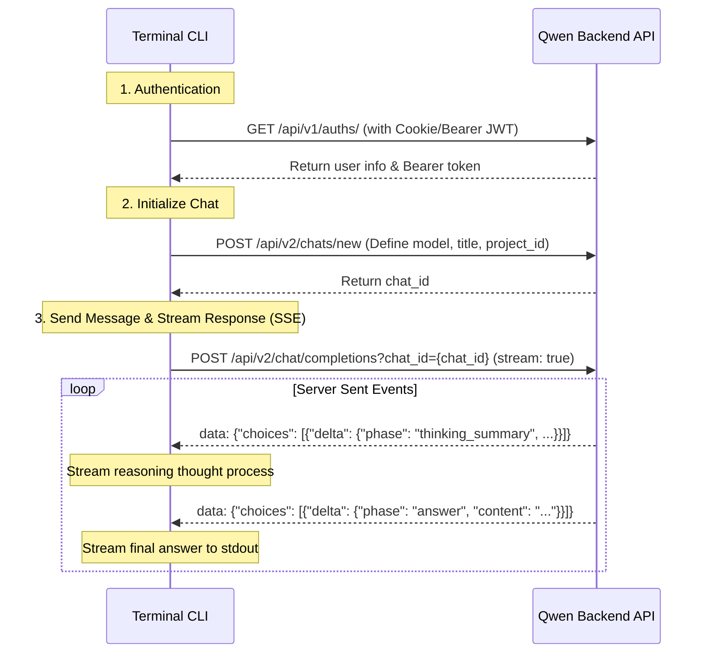

# Báo cáo Phân tích & Thiết kế Qwen Chat Web trên Terminal

Báo cáo này phân tích chi tiết các tính năng, giao diện của trang Qwen Chat Web dựa trên **20 ảnh chụp màn hình** trong thư mục `screen/` và các API endpoint trích xuất từ file HAR `chat.qwen.ai.har`. Mục tiêu của báo cáo là cung cấp đầy đủ thông tin kỹ thuật để bạn phát triển một ứng dụng Terminal CLI bằng Javascript không cần bật trình duyệt.

---

## 1. Phân tích Chi tiết Các Màn hình Giao diện (Screenshots)

Thư mục `screen/` bao gồm 20 hình ảnh ghi lại các trạng thái giao diện của Qwen Chat. Dưới đây là phân tích chi tiết từng màn hình và tính năng tương ứng:

### A. Giao diện Chat Chính & Chọn Mô hình
*   **Screenshot chính** ([Screenshot 18-56-18.png](file:///mnt/181EC3061EC2DBBE/DT/Code/PJ/ai-chat-cli/qwen-cli/screen/Screenshot%20from%202026-06-28%2018-56-18.png), [Screenshot 18-55-47.jpeg](file:///mnt/181EC3061EC2DBBE/DT/Code/PJ/ai-chat-cli/qwen-cli/screen/Screenshot_28-6-2026_185547_chat.qwen.ai.jpeg), [Screenshot 18-56-8.jpeg](file:///mnt/181EC3061EC2DBBE/DT/Code/PJ/ai-chat-cli/qwen-cli/screen/Screenshot_28-6-2026_18568_chat.qwen.ai.jpeg)):
    *   **Sidebar bên trái**:
        *   Logo Qwen ở góc trên bên trái.
        *   Nút **+ New Chat** dùng để bắt đầu phiên chat mới.
        *   Nút **Search Chats** giúp tìm kiếm các đoạn hội thoại cũ.
        *   Mục **Community** và **Coder** (lối tắt chuyên biệt cho lập trình viên).
        *   Mục **Projects**: Hiển thị danh sách dự án (ví dụ project `model classifier`) và nút **+ New Project**.
        *   Mục **All chats**: Hiển thị danh sách hội thoại gần đây (ví dụ: "Friendly Greeting Exchange").
        *   Góc dưới cùng bên trái: Avatar và tên người dùng đăng nhập ("Tuệ Trí").
    *   **Khu vực chọn Mô hình (Model Dropdown)**:
        *   Nằm ở góc trên cùng của khung chat. Nhấp vào sẽ mở ra menu chọn model.
        *   Hỗ trợ toggle **Model Comparison** để so sánh câu trả lời của các model.
        *   Các model chính:
            *   **Qwen3.7-Plus** (Mặc định): Model đa phương thức (multimodal), xử lý text, hình ảnh, video, âm thanh, hỗ trợ reasoning (thinking) và gọi tool.
            *   **Qwen3.7-Max**: Model đầu bảng (flagship), tối ưu hóa cho tác vụ suy nghĩ sâu, hiện tại chỉ hỗ trợ văn bản (text-only, không có vision).
            *   **Qwen3.6-Plus**: Model thế hệ trước hỗ trợ multimodal.
        *   Nút **Expand more models >** hiển thị các model thử nghiệm và mã nguồn mở:
            *   *Qwen3.6-Max-Preview*: Model preview của dòng 3.6 Max (chưa hỗ trợ Search và Code Interpreter).
            *   *Qwen3.6-27B*: Model mã nguồn mở 27 tỷ tham số tối ưu cho triển khai cục bộ.
            *   *Qwen3.7-Max-Preview*: Phiên bản preview của 3.7 Max.
    *   **Khung hiển thị tin nhắn**:
        *   Tin nhắn của người dùng nằm bên phải.
        *   Tin nhắn của trợ lý ảo nằm bên trái, hỗ trợ mục **Thinking completed >** (có thể click vào để xem chi tiết quá trình suy nghĩ của AI).
        *   Dưới câu trả lời có các nút tương tác nhanh: Copy, Like, Dislike, Share, Regenerate, và Menu bổ sung "...".

### B. Menu Công cụ Nhập liệu & Bảng Chọn Chế độ Suy nghĩ (Thinking Mode)
*   **Menu "+" (Công cụ đính kèm & Chuyên biệt)** ([Screenshot 18-56-51.png](file:///mnt/181EC3061EC2DBBE/DT/Code/PJ/ai-chat-cli/qwen-cli/screen/Screenshot%20from%202026-06-28%2018-56-51.png)):
    *   Nhấp vào nút "+" ở góc trái ô nhập liệu sẽ mở ra menu popup chứa các công cụ:
        1.  **Upload attachment**: Upload file đính kèm (hỗ trợ file tài liệu, hình ảnh, video, âm thanh).
        2.  **Deep Research**: Chế độ nghiên cứu chuyên sâu (duyệt nhiều web, tổng hợp tài liệu).
        3.  **Create Image**: Tạo ảnh từ văn bản.
        4.  **Create Video**: Tạo video.
        5.  **Web Dev**: Chế độ lập trình web, có xem trước giao diện.
        6.  **Slides**: Tạo bài thuyết trình PowerPoint/Slides.
        7.  **More >**: Mở rộng thêm các công cụ: **Web search** (Tìm kiếm web), **Artifacts** (Xem mã nguồn/tài liệu dạng trực quan), **Learn** (Học tập), **Travel Planner** (Lên kế hoạch du lịch).
        8.  **Tools Toggle**: Công tắc bật/tắt quyền sử dụng plugin/tool của AI.
*   **Menu chọn chế độ suy nghĩ** ([Screenshot 18-56-39.jpeg](file:///mnt/181EC3061EC2DBBE/DT/Code/PJ/ai-chat-cli/qwen-cli/screen/Screenshot_28-6-2026_185639_chat.qwen.ai.jpeg)):
    *   Nằm ở góc phải ô nhập liệu (bên cạnh nút Micro). Có 3 chế độ suy nghĩ cho AI:
        1.  **Auto**: Tự động quyết định khi nào cần suy nghĩ sâu.
        2.  **Thinking**: Bắt buộc AI phải suy nghĩ sâu (Reasoning) trước khi đưa ra câu trả lời.
        3.  **Fast**: Trở lại phong cách chat thông thường, trả lời ngay lập tức không qua bước suy nghĩ (tiết kiệm thời gian và token).

### C. Màn hình Cấu hình Cài đặt (Settings)
Giao diện Settings chia làm nhiều tab chuyên biệt bên sidebar trái:
1.  **General (Cài đặt chung)** ([Screenshot 18-57-13.jpeg](file:///mnt/181EC3061EC2DBBE/DT/Code/PJ/ai-chat-cli/qwen-cli/screen/Screenshot_28-6-2026_185713_chat.qwen.ai.jpeg)):
    *   *Theme*: System, Light, Dark (đang chọn Dark).
    *   *Language*: Dropdown chọn ngôn ngữ hiển thị (đang chọn English (US)).
    *   *Voice*: Lựa chọn giọng đọc Text-to-Speech (đang chọn giọng "Katerina").
2.  **Interface (Giao diện hội thoại)** ([Screenshot 18-57-17.png](file:///mnt/181EC3061EC2DBBE/DT/Code/PJ/ai-chat-cli/qwen-cli/screen/Screenshot%20from%202026-06-28%2018-57-17.png)):
    *   *Title Auto-Generation* (Bật): Tự động đặt tên tiêu đề chat dựa trên nội dung câu hỏi đầu tiên.
    *   *Auto-Copy Response to Clipboard* (Tắt): Tự động copy câu trả lời của AI vào clipboard.
    *   *Paste Large Text as File* (Bật): Tự động chuyển văn bản siêu dài thành file đính kèm khi dán vào ô chat.
3.  **Models (Thông tin mô hình)** ([Screenshot 18-57-22.png](file:///mnt/181EC3061EC2DBBE/DT/Code/PJ/ai-chat-cli/qwen-cli/screen/Screenshot%20from%202026-06-28%2018-57-22.png)):
    *   Danh sách tất cả các model được hệ thống hỗ trợ (từ dòng Qwen3.5 đến Qwen3.7). Mỗi model có một dropdown để mở rộng thông tin chi tiết.
4.  **Chats (Quản lý hội thoại)** ([Screenshot 18-57-24.png](file:///mnt/181EC3061EC2DBBE/DT/Code/PJ/ai-chat-cli/qwen-cli/screen/Screenshot%20from%202026-06-28%2018-57-24.png)):
    *   *Import Chats*: Nhập lịch sử chat từ file sao lưu.
    *   *Export Chats*: Xuất dữ liệu lịch sử chat của tài khoản.
    *   *Archive All Chats*: Lưu trữ toàn bộ các đoạn chat.
    *   *Delete All Chats*: Xóa vĩnh viễn toàn bộ các đoạn chat.
5.  **Personalization (Cá nhân hóa & Memory)** ([Screenshot 18-57-26.png](file:///mnt/181EC3061EC2DBBE/DT/Code/PJ/ai-chat-cli/qwen-cli/screen/Screenshot%20from%202026-06-28%2018-57-26.png)):
    *   *Memory (Manage)*: Quản lý bộ nhớ lưu thông tin dài hạn về người dùng.
    *   *Reference saved memories*: Qwen tự động lưu và tham chiếu bộ nhớ khi trả lời.
    *   *Reference the chat history*: Tham chiếu các tin nhắn cũ ngoài phiên chat hiện tại.
    *   *Customize Qwen (Settings)*: Thiết lập Custom Instructions (Hồ sơ người dùng & phong cách phản hồi).
    *   *Manage Cookies*: Quản lý cookie theo dõi/quảng cáo.
    *   *Advanced (Tool configurations)*: Cho phép bật/tắt từng tool mặc định của AI (Web Scraping, Image search, Web search, Image generation...).
6.  **Saved Memory Popup** ([Screenshot 18-57-28.png](file:///mnt/181EC3061EC2DBBE/DT/Code/PJ/ai-chat-cli/qwen-cli/screen/Screenshot%20from%202026-06-28%2018-57-28.png)):
    *   Lưu trữ tối đa 50 mục thông tin cá nhân. Vượt quá 50 mục sẽ tự động xóa mục cũ nhất.
7.  **Customize Qwen Popup** ([Screenshot 18-57-31.png](file:///mnt/181EC3061EC2DBBE/DT/Code/PJ/ai-chat-cli/qwen-cli/screen/Screenshot%20from%202026-06-28%2018-57-31.png)):
    *   *What would you like Qwen to call you?* (Nickname): Tên AI dùng gọi bạn (tối đa 128 ký tự).
    *   *What would you like Qwen to know about you...*: Thông tin cá nhân để AI cá nhân hóa câu trả lời (tối đa 500 ký tự).
    *   *How would you like Qwen to respond?*: Chọn phong cách trả lời gồm: *Default* (Cân bằng), *Concise* (Ngắn gọn), *Socratic* (Gợi mở câu hỏi), *Formal* (Trang trọng/Học thuật).
    *   *Custom instruction*: Luật lệ hoặc định dạng phản hồi bắt buộc.
8.  **Account & About** ([Screenshot 18-57-38.png](file:///mnt/181EC3061EC2DBBE/DT/Code/PJ/ai-chat-cli/qwen-cli/screen/Screenshot%20from%202026-06-28%2018-57-38.png), [Screenshot 18-57-40.png](file:///mnt/181EC3061EC2DBBE/DT/Code/PJ/ai-chat-cli/qwen-cli/screen/Screenshot%20from%202026-06-28%2018-57-40.png)):
    *   Hiển thị thông tin tài khoản, đổi mật khẩu, xóa tài khoản.
    *   Hiển thị thông tin phiên bản, liên kết MXH của dự án Qwen.

### D. Quản lý Dự án (Projects)
*   **Popup tạo Dự án mới** ([Screenshot 18-57-52.png](file:///mnt/181EC3061EC2DBBE/DT/Code/PJ/ai-chat-cli/qwen-cli/screen/Screenshot%20from%202026-06-28%2018-57-52.png), [Screenshot 18-57-55.png](file:///mnt/181EC3061EC2DBBE/DT/Code/PJ/ai-chat-cli/qwen-cli/screen/Screenshot%20from%202026-06-28%2018-57-55.png), [Screenshot 18-57-56.png](file:///mnt/181EC3061EC2DBBE/DT/Code/PJ/ai-chat-cli/qwen-cli/screen/Screenshot%20from%202026-06-28%2018-57-56.png)):
    *   Tạo không gian làm việc độc lập. Có các tag gợi ý nhanh: *Investment*, *Homework*, *Writing*, *Health*, *Travel*.
    *   **Advanced Settings**:
        *   *Memory Mode*: Chọn **Default** (Chia sẻ ký ức với tài khoản chính) hoặc **Project-only** (Cô lập ký ức trong dự án hiện tại).
        *   *Instructions*: Hướng dẫn cấu hình hệ thống (system prompt) riêng cho dự án này (tối đa 1000 ký tự).
        *   *Files*: Nút **Add Files** để tải tài liệu lên làm cơ sở tri thức (Knowledge Base) riêng của dự án.
*   **Giao diện Chat trong Dự án** ([Screenshot 18-58-06.png](file:///mnt/181EC3061EC2DBBE/DT/Code/PJ/ai-chat-cli/qwen-cli/screen/Screenshot%20from%202026-06-28%2018-58-06.png), [Screenshot 18-58-10.png](file:///mnt/181EC3061EC2DBBE/DT/Code/PJ/ai-chat-cli/qwen-cli/screen/Screenshot%20from%202026-06-28%2018-58-10.png)):
    *   Hiển thị biểu tượng folder lớn kèm tên dự án.
    *   Mọi cuộc hội thoại trong giao diện này tự động được gán vào `project_id`.
    *   Menu cài đặt dự án (ba chấm góc phải) hỗ trợ các tính năng: **Pin**, **Rename**, **Clone**, **Archive**, **Share**, **Download**, **Move to Project**, **Move from Project**, **Delete**.

---

## 2. Phân tích Dữ liệu API từ File HAR (`chat.qwen.ai.har`)

Do file HAR được export từ trình duyệt, các header nhạy cảm như `Cookie` và `Authorization` có thể đã bị trình duyệt lược bỏ để bảo mật. Tuy nhiên, thông qua các API payload trích xuất được, ta có thể xây dựng lại toàn bộ logic gọi API như sau:



### A. Endpoint Xác thực (Authentication)
*   **Endpoint**: `GET https://chat.qwen.ai/api/v1/auths/`
*   **Request Headers quan trọng**:
    *   `Accept`: `application/json, text/plain, */*`
    *   `Version`: `0.2.67` (phiên bản app front-end)
    *   `X-Request-Id`: UUID ngẫu nhiên do client sinh ra cho mỗi request.
*   **Response Body (JSON)**:
    ```json
    {
      "id": "9cf1479e-2bf0-47b2-9619-e06fc51bac87",
      "email": "tuet805@gmail.com",
      "name": "Tuệ Trí",
      "role": "user",
      "token": "eyJhbGciOiJIUzI1NiIsInR5cCI6IkpXVCJ9...",
      "token_type": "Bearer",
      "expires_at": 1785239114,
      "permissions": {
        "chat": {
          "file_upload": true,
          "delete": true,
          "edit": true,
          "temporary": true
        }
      }
    }
    ```
    > [!IMPORTANT]
    > **Cơ chế xác thực**: Server trả về JWT token dạng Bearer trong response. Để gọi các API khác, bạn cần đưa token này vào header `Authorization: Bearer <token>`. Đồng thời, trang web sử dụng Cookie của trình duyệt để duy trì session. CLI của bạn nên hỗ trợ cả cấu hình Cookie và Bearer token.

### B. Endpoint Tạo Cuộc hội thoại mới (Create New Chat)
*   **Endpoint**: `POST https://chat.qwen.ai/api/v2/chats/new`
*   **Request Body**:
    ```json
    {
      "title": "New Chat",
      "models": ["qwen3.7-plus"],
      "chat_mode": "normal",
      "chat_type": "t2t",
      "timestamp": 1782647224575,
      "project_id": "bddbf898-1322-44cc-a8d2-5b92a9a307c9"
    }
    ```
    *(Nếu không chat trong dự án, trường `project_id` có thể truyền `null` hoặc bỏ qua).*
*   **Response Body**:
    ```json
    {
      "success": true,
      "request_id": "7cf2cfc9-dadd-4023-b8f3-324fcd55c7eb",
      "data": {
        "id": "7699bf32-e79d-400d-b950-69269d7b46ef"
      }
    }
    ```
    *(Giá trị `id` trả về chính là `chat_id` dùng cho các request tiếp theo).*

### C. Endpoint Chat Completions (Gửi tin nhắn & Nhận Stream)
*   **Endpoint**: `POST https://chat.qwen.ai/api/v2/chat/completions?chat_id={chat_id}`
*   **Request Headers**:
    *   `Accept`: `application/json`
    *   `Content-Type`: `application/json`
    *   `X-Accel-Buffering`: `no` (để tránh proxy buffer dữ liệu stream)
*   **Request Body**:
    ```json
    {
      "stream": true,
      "version": "2.1",
      "incremental_output": true,
      "chat_id": "7699bf32-e79d-400d-b950-69269d7b46ef",
      "chat_mode": "normal",
      "model": "qwen3.7-plus",
      "parent_id": null,
      "messages": [
        {
          "fid": "f42bcebb-e27e-4f3f-b3b0-7b3578425dee", // Message ID ngẫu nhiên do client sinh
          "parentId": null,
          "childrenIds": ["9ba6f09a-f409-4099-94e4-907979ca04fe"],
          "role": "user",
          "content": "hello",
          "user_action": "chat",
          "files": [],
          "timestamp": 1782647224,
          "models": ["qwen3.7-plus"],
          "chat_type": "t2t",
          "feature_config": {
            "thinking_enabled": true,       // Bật chế độ suy nghĩ sâu
            "auto_thinking": false,          // false nếu bắt buộc dùng Thinking/Fast
            "thinking_mode": "Thinking",    // "Thinking" hoặc "Fast"
            "thinking_format": "summary",
            "auto_search": true             // Bật/tắt Web Search
          },
          "extra": {
            "meta": { "subChatType": "t2t" }
          },
          "sub_chat_type": "t2t"
        }
      ],
      "timestamp": 1782647224
    }
    ```
*   **Cấu trúc dữ liệu Response (Server-Sent Events)**:
    API trả về kiểu `text/event-stream`. Dữ liệu được chia thành 3 giai đoạn rõ rệt:
    
    1.  **Giai đoạn Khởi tạo**:
        ```javascript
        data: {"response.created":{"chat_id": "7699bf32-e79d-400d-b950-69269d7b46ef", "response_id":"db05e503-e627-4ffc-aa21-034ab3ffedb7", ...}}
        ```
    2.  **Giai đoạn Suy nghĩ sâu (`thinking_summary`)**:
        Trong khi model suy nghĩ, nó liên tục gửi về các gói tin:
        ```javascript
        data: {
          "choices": [{
            "delta": {
              "role": "assistant",
              "content": "",
              "phase": "thinking_summary", // Đang trong phase suy nghĩ
              "extra": {
                "summary_title": { "content": ["Initiating response..."] },
                "summary_thought": { "content": ["I need to greeting the user..."] }
              },
              "status": "typing"
            }
          }],
          "response_id": "db05e503-e627..."
        }
        ```
        Sau khi hoàn thành suy nghĩ, server gửi sự kiện kết thúc phase suy nghĩ:
        ```javascript
        data: {"choices": [{"delta": {"role": "assistant", "content": "", "phase": "thinking_summary", "status": "finished"}}], ...}
        ```
    3.  **Giai đoạn Trả lời chính thức (`answer`)**:
        Các token câu trả lời được stream về:
        ```javascript
        data: {"choices": [{"delta": {"role": "assistant", "content": "Hello.", "phase": "answer", "status": "typing"}}], ...}
        data: {"choices": [{"delta": {"role": "assistant", "content": " How may I be", "phase": "answer", "status": "typing"}}], ...}
        ```
        Khi kết thúc hoàn toàn:
        ```javascript
        data: {"choices": [{"delta": {"content": "", "role": "assistant", "status": "finished", "phase": "answer"}}], ...}
        ```

### D. Endpoint Danh sách Models & Setting Config
*   **Get Models**: `GET https://chat.qwen.ai/api/v2/models/`
    *   Trả về danh sách model khả dụng kèm các metadata (`capabilities`: vision, document, video, audio, thinking, search).
*   **Get Configs**: `GET https://chat.qwen.ai/api/v2/configs/setting-config`
    *   Trả về trạng thái bật/tắt các công cụ mở rộng (Web Scraping, Image Search, Web Search, Code Interpreter, Memory...).

---

## 3. Thử thách Bảo mật & Giải pháp Kỹ thuật cho Terminal CLI

> [!WARNING]
> **Cơ chế chống Bot của Alibaba (Alibaba WAF)**
> Trong file HAR, ta thấy sự xuất hiện của các request header đặc biệt:
> *   `bx-ua`: Chuỗi mã hóa sinh ra từ browser fingerprint của Alibaba Sec-SDK.
> *   `bx-umidtoken`: Token định danh thiết bị duy nhất.
> *   `bx-v`: Phiên bản SDK bảo mật.
> 
> Nếu bạn viết một CLI thuần túy bằng `axios` hoặc `node-fetch` và gửi trực tiếp các API request trên mà không có các header này (hoặc sử dụng các giá trị bị lỗi thời), Alibaba WAF có thể chặn request của bạn với mã lỗi **403 Forbidden** hoặc bắt giải Slide Captcha.

### Giải pháp kỹ thuật được đề xuất cho CLI:

1.  **Cách tiếp cận Hybrid (Khuyên dùng cho CLI ổn định)**:
    *   Sử dụng một thư viện headless browser siêu nhẹ như **Playwright** hoặc **Puppeteer** (chạy chế độ headless) ở background để thực hiện bước Login và lấy Cookie/Token, đồng thời để nó tự động xử lý và sinh ra các header bảo mật (`bx-ua`, `bx-umidtoken`).
    *   Khi đã có session, Playwright có thể lắng nghe trực tiếp API hoặc thực hiện request ngay trong ngữ cảnh trình duyệt giả lập, sau đó stream kết quả về console của Terminal.
2.  **Cách tiếp cận Direct API (Đơn giản nhưng dễ lỗi)**:
    *   Yêu cầu người dùng copy thủ công toàn bộ Cookie và các header bảo mật từ Browser (thông qua F12 DevTools) dán vào file cấu hình `.env` của CLI.
    *   CLI sẽ map chính xác các header này vào request `axios`/`node-fetch`. Tuy nhiên, các token chống bot như `bx-ua` thường hết hạn rất nhanh hoặc thay đổi theo từng request, nên cách này có thể phải cập nhật cấu hình liên tục.

### Cấu trúc Mock-up luồng hoạt động trên Terminal CLI (Javascript):

```javascript
import { spawn } from 'child_process';
// CLI có thể sử dụng các thư viện UI:
// - 'inquirer' để hiển thị menu chọn Model, chọn Chế độ (Auto/Fast/Thinking).
// - 'ora' để tạo spinner loading khi AI đang suy nghĩ (thinking_summary).
// - 'chalk' để phân biệt màu sắc giữa suy nghĩ của AI (màu xám nhạt) và câu trả lời chính thức (màu xanh lá/trắng).

async function startCLI() {
  const model = await selectModel(); // dropdown chọn Qwen3.7-Plus, Qwen3.7-Max...
  const mode = await selectMode();   // Auto, Thinking, Fast
  const enableSearch = await toggleSearch(); // Bật/tắt Web Search
  
  const chatSession = await createNewChat(model);
  
  while (true) {
    const userInput = await promptUser();
    if (userInput === '/exit') break;
    
    const spinner = ora('AI is thinking...').start();
    
    // Gửi request API completions với feature_config tương ứng
    const stream = await sendCompletionsAPI(chatSession.id, userInput, {
      thinking_enabled: mode !== 'Fast',
      auto_thinking: mode === 'Auto',
      auto_search: enableSearch
    });
    
    stream.on('data', (event) => {
      if (event.phase === 'thinking_summary') {
        // Cập nhật nội dung suy nghĩ xám nhạt lên màn hình
        spinner.text = chalk.gray(`[Thinking]: ${event.thought_title}`);
      } else if (event.phase === 'answer') {
        if (spinner.isSpinning) spinner.stop();
        // In trực tiếp token ra terminal
        process.stdout.write(event.content);
      }
    });
  }
}
```

---

## 4. Kế hoạch Phát triển Dự án

Dưới đây là các bước để bạn xây dựng dự án:

- [ ] **Bước 1: Thiết lập cấu hình Xác thực (Auth & Bypass WAF)**:
  - Viết module nodejs kiểm tra kết nối tới `/api/v1/auths/`.
  - Thử nghiệm gửi request có kèm Cookie trình duyệt xem có bị WAF chặn không.
- [ ] **Bước 2: Xây dựng Module API chính**:
  - Viết hàm tạo chat mới (`/api/v2/chats/new`).
  - Viết hàm gửi tin nhắn hỗ trợ Server-Sent Events để parse stream dữ liệu.
- [ ] **Bước 3: Xử lý hiển thị Thinking & Answer**:
  - Parse các event có `phase: "thinking_summary"` để render giao diện suy nghĩ.
  - Parse `phase: "answer"` để in câu trả lời ra terminal theo thời gian thực.
- [ ] **Bước 4: Xây dựng UI Terminal**:
  - Dùng `inquirer` để tạo các bước cấu hình trước khi chat (Chọn model, chọn mode, upload file).
  - Tích hợp tính năng Upload File (nếu cần, gửi thông tin file lên API trước khi chat).
