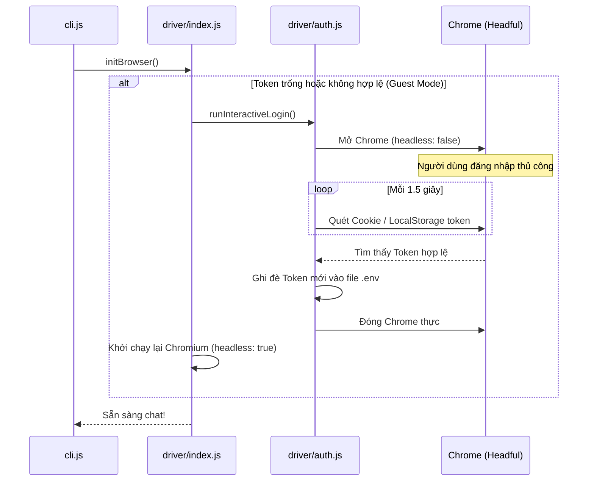
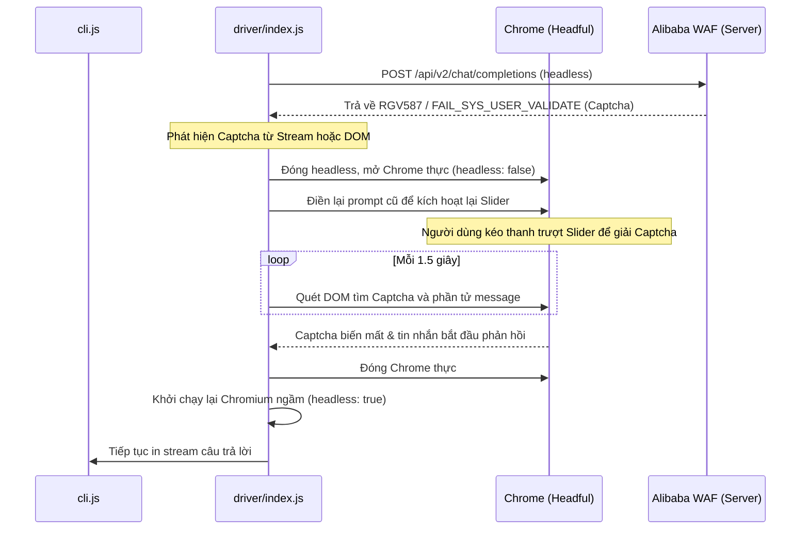

# Trình điều khiển Trình duyệt (`src/driver/`)

Thư mục này đóng gói toàn bộ logic liên quan đến tự động hóa trình duyệt (Playwright), can thiệp mạng (Fetch Hook) và xử lý xác thực/bảo mật để kết nối ổn định với Qwen Chat Web.

---

## 1. Cấu trúc và Nhiệm vụ các Module

### 📄 `index.js`
Đóng vai trò là bộ điều phối trung tâm (Orchestrator) quản lý toàn bộ vòng đời của trình duyệt Chromium.
- **Khởi tạo**: Chạy Chromium ở chế độ ẩn ngầm (`headless: true`) đi kèm cấu hình nâng cao để bypass phát hiện bot (user-agent, stealth plugin, disable-automation-flags).
- **Giao tiếp IPC**: Đăng ký các hàm binding hai chiều giữa Node.js và môi trường trình duyệt:
  - `__qwenChunk(encodedStr)`: Nhận các chunk dữ liệu stream SSE được gửi về từ Fetch Hook. Nó chủ động phát hiện lỗi Captcha (`FAIL_SYS_USER_VALIDATE` hoặc `RGV587`) để kích hoạt chế độ giải Captcha tương tác.
  - `__qwenDone()`: Phát tín hiệu hoàn thành stream.
  - `__qwenErr(errMsg)`: Xử lý và chuyển tiếp lỗi stream.
- **Tải lên file đính kèm (`uploadFile`)**: Mô phỏng hành vi click thực tế của người dùng:
  1. Click nút dấu cộng `+` (`div.mode-select`) bên trong ô nhập liệu.
  2. Bắt sự kiện mở hộp thoại chọn file của hệ thống (`filechooser`) khi click vào tùy chọn `Upload attachment`.
  3. Sử dụng Playwright `fileChooser.setFiles(resolvedPath)` để nạp file (tự động phân giải đường dẫn tương đối dựa theo thư mục làm việc hiện tại của terminal).
- **Giao diện API cung cấp cho CLI**: `initBrowser()`, `sendPrompt(text)`, `closeBrowser()`, `setWebSearch(bool)`, `getWebSearch()`, `uploadFile(path)`.

### 📄 `auth.js`
Tập hợp các logic xử lý trạng thái phiên làm việc và bảo mật.
- `runInteractiveLogin()`: Tự động khởi chạy một cửa sổ Chromium thực (`headless: false`) mở trang đăng nhập Qwen. Logic sẽ liên tục kiểm tra (polling 1.5 giây/lần) cho đến khi người dùng đăng nhập thành công. Ngay khi bắt được cookie hoặc LocalStorage chứa token hợp lệ, nó sẽ lưu đè vào file `.env` ở thư mục gốc, đóng trình duyệt headful và nhường chỗ cho luồng headless tiếp tục.
- `checkIsGuest(page)`: Kiểm tra xem URL hoặc nội dung trang web hiện tại có chứa thông tin bắt đăng nhập (`/guest`, `/login`, nút `Log in`/`Sign up`) để xác định xem token hiện tại đã hết hạn hay chưa.
- `checkHasCaptcha(page)`: Quét nội dung văn bản (innerText) trên toàn bộ trang để tìm các từ khóa đặc trưng của Aliyun WAF Captcha như: *Access Verification, slide to verify, drag the slider, verify that you are a real person, 滑块, 拖 động, 哎哟喂*.

### 📄 `hook.js`
Định nghĩa script can thiệp luồng mạng `INIT_SCRIPT`.
- Được tiêm vào ngữ cảnh trang web trước khi tải bất kỳ mã nguồn DOM nào thông qua `page.addInitScript()`.
- Thực hiện tiêm cưỡng chế token đăng nhập vào `localStorage.setItem('token')` và `active_token`.
- Ghi đè phương thức `window.fetch` mặc định của trình duyệt. Khi phát hiện URL gọi đến API chat (`/api/v2/chat/completions`), hook sẽ can thiệp vào `Response` nhận được:
  - Sử dụng API `response.body.tee()` để nhân bản stream dữ liệu gốc làm 2 luồng.
  - Luồng thứ nhất (`stream[0]`): Trả lại cho Web App Qwen xử lý và hiển thị lên giao diện web bình thường.
  - Luồng thứ hai (`stream[1]`): Dùng `ReadableStreamReader` đọc tuần tự các chunk nhị phân, giải mã thành UTF-8 qua `TextDecoder` và gọi hàm IPC `window.__qwenChunk(encodeURIComponent(text))` để gửi dữ liệu về CLI Node.js theo thời gian thực.
- Can thiệp payload gửi đi của API chat để ghim đè cấu hình tìm kiếm web (`auto_search`) theo trạng thái điều khiển từ CLI Node.js.

---

## 2. Quy trình Xử lý Tự động hóa khi gặp lỗi xác thực hoặc Captcha

### A. Luồng Interactive Login (Đăng nhập tương tác)

### B. Luồng Interactive Captcha Solver (Giải Captcha tương tác)

---

## 3. Các thông số cấu hình quan trọng
*   **Selector nút dấu cộng (Plus Button)**: `.mode-select` (dùng để mở menu các công cụ đính kèm).
*   **Nút Upload File**: `text="Upload attachment"` (tùy chọn nằm trong menu dấu cộng).
*   **Input File ẩn**: `input#filesUpload` (được kích hoạt gián tiếp qua sự kiện `filechooser` của Playwright để đảm bảo React và Ant Design nhận diện thành công).
*   **Selector ô nhập liệu**: `textarea.message-input-textarea, textarea` (tự động tương thích với các phiên bản thay đổi DOM của Qwen).
*   **Selector nút gửi**: `button.send-button` (chỉ xuất hiện khi React nhận diện được textarea đã có dữ liệu thông qua API `page.fill()`).
*   **Thời gian trễ ổn định**: `2000ms` sau khi load trang (đảm bảo React hoàn tất hydrate và SDK bảo mật của Alibaba ghim đè/khởi chạy xong trước khi CLI gửi prompt).
